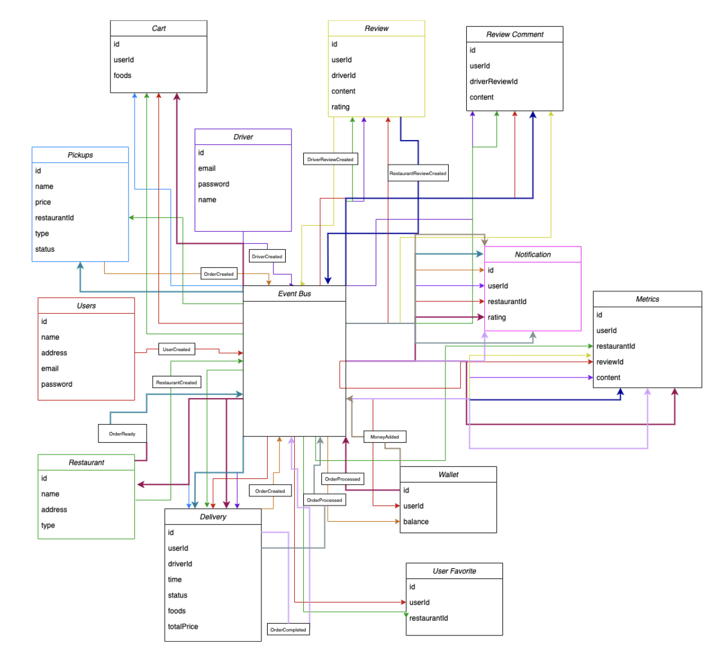

# Bite-Mates

An Uber Eats like application. Users are allowed to view restaurants and the food they want to order for delivery. Drivers will be able to accept orders.

An asynchronous microservice architecture is used to abstract away the details and improve performance and scalability. Authentication through the use of JWT tokens is also implemented.

Tech stack used: 
Typescript, Node.js, JWT, MongoDB, Docker, Express.js 

 </img>

### Youtube Video Presentation:

https://www.youtube.com/watch?v=t7rv692qPlU

### Documentation 

https://docs.google.com/document/d/1dzinc7W6rAlgjjJYkdG2JAWzxBK4P9k0CJVV7zMi-hE/edit?usp=sharing
